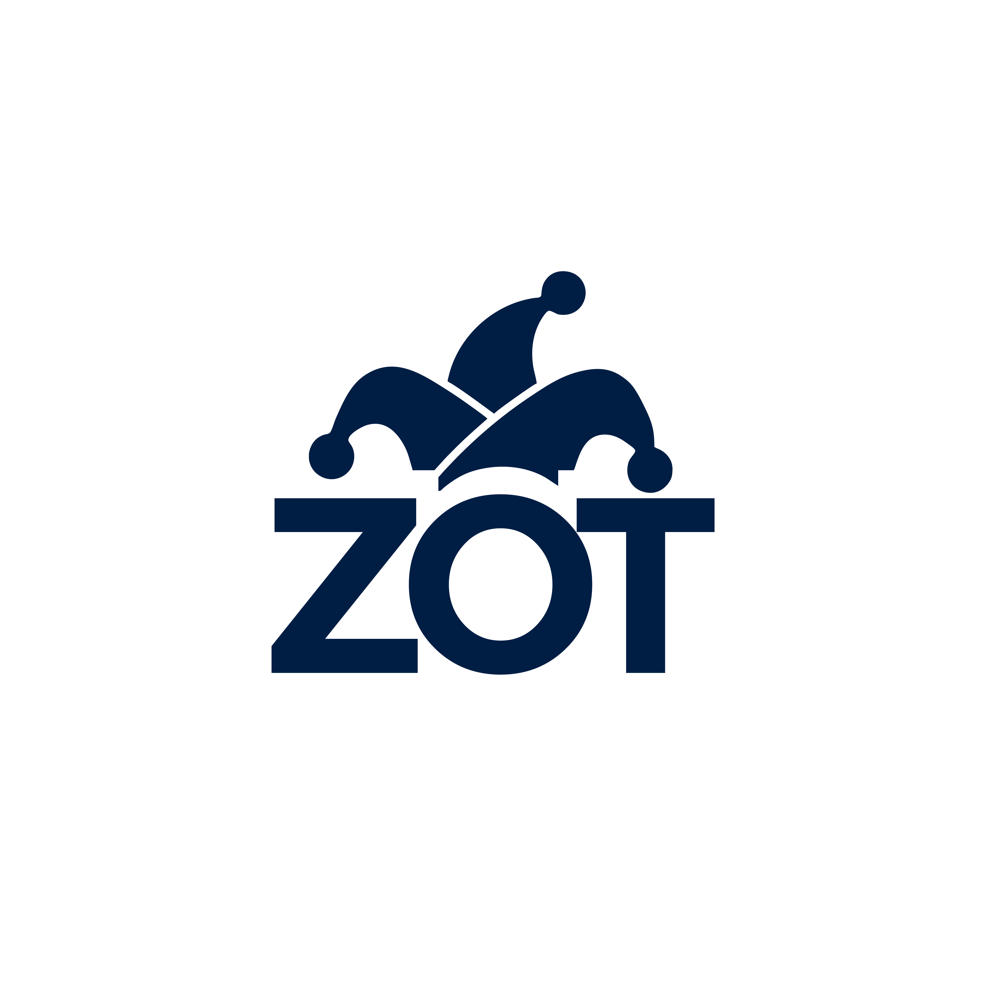

= zot Brand Guidelines

This repository contains Color schemes, logos, and rules for branding. Of the zot project.

== Name

zot is preferably presented all lowercase.  Zot is also acceptable.

== Color Scheme

=== Logo Colors

Primary: #A53692

Secondary: #4A5F12

Tertiary: #F58634 

=== Text Colors

Dark Color: #001E44

Light Color: #FFFFFF

== Logos

=== Standard

image::assets/zot-01.png[zot logo dark blue text on white background]
image::assets/zot-02.png[zot logo white text on dark blue background]
image::assets/zot-03.png[zot white logo white text on orange background]

=== Transparent Background

image::assets/zot-1T.png[zot logo dark blue text on transparent background]
image::assets/zot-2T.png[zot logo white text on transparent background]
image::assets/zot-3T.png[zot white logo white text on transparent background]
image::assets/zot-4T.png[zot dark blue logo dark blue text on transparent background]

=== Vector Assets

link:assets/zot.eps[Encapsulated PostScript]

link:assets/zot.ai[Adobe Illustrator]

=== Other Formats

link:assets/zot.pdf[Portable Document Format]